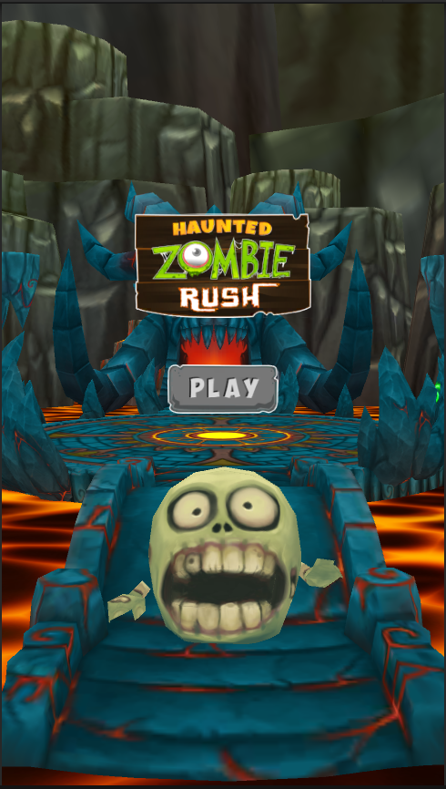
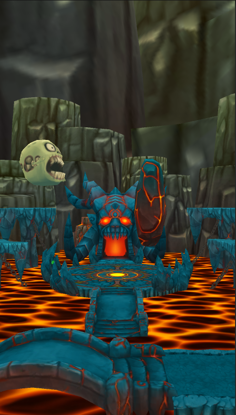

# 🧟‍♂️ Haunted Zombie Rush

**Haunted Zombie Rush** is a 3D endless jumper game built with Unity, inspired by the mechanics of Flappy Bird. Instead of a bird, you control a zombie navigating through a haunted world filled with moving pillars. Simple to play, hard to master — how far can you get before it's game over?

---

## 🎮 Gameplay

- Tap or click to make the zombie "jump" or float upward.
- Avoid crashing into dynamically moving pillars.
- The game gets progressively harder the longer you survive.
- Score increases as you successfully pass obstacles.

---

## 🧰 Built With

- **Unity (C#)** – Game engine and scripting.
- **Rigidbody Physics** – For realistic jump and collision behavior.
- **Unity UI System** – For score display and game-over handling.
- **3D Environment & Models** – Basic assets and environment setup.

---

## 🧠 Key Features

- 🧟‍♂️ 3D zombie-themed endless jumper
- ⛩️ Moving pillars as dynamic obstacles
- 🎮 One-tap input system
- 📈 Score tracking
- 🔁 Fast restarts for continuous gameplay

---

## ✨ Screenshots




---

## 🧑‍💻 Developer

**Keshav Singh** – Developer and designer of the game.  
Feel free to explore the code, open issues, or suggest improvements.

---

## 📁 Project Structure

```
HauntedZombieRush/
├── Assets/
├── Packages/
├── ProjectSettings/
├── .gitignore
├── README.md
```

> Note: This repository contains the full Unity project. To run or modify the game, open it using Unity (version XX.X or later recommended).

---

## 🚀 Getting Started

1. Clone the repository:
   ```bash
   git clone https://github.com/Kesin2540/haunted-zombie-rush.git
